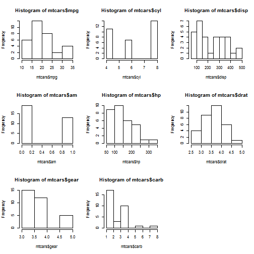

Presentation for Developing Data Products Assignment
========================================================
author: Cristian Popescu
date: September 10th 
autosize: true
width: 1600

Introduction
========================================================

The following presentation will intend to guiden the user through the assignment for **Develping Data Products course**.

For our assignment, the data to be used was **mtcars**


```r
head(mtcars)
```

```
                   mpg cyl disp  hp drat    wt  qsec vs am gear carb
Mazda RX4         21.0   6  160 110 3.90 2.620 16.46  0  1    4    4
Mazda RX4 Wag     21.0   6  160 110 3.90 2.875 17.02  0  1    4    4
Datsun 710        22.8   4  108  93 3.85 2.320 18.61  1  1    4    1
Hornet 4 Drive    21.4   6  258 110 3.08 3.215 19.44  1  0    3    1
Hornet Sportabout 18.7   8  360 175 3.15 3.440 17.02  0  0    3    2
Valiant           18.1   6  225 105 2.76 3.460 20.22  1  0    3    1
```


Lets get started
========================================================


- Open the right drop-down 
  - Select one of the options (e.g. MPG, Cylinders etc)
- Observe on the right panel the histogram of the data selected (e.g. Cylinders or MPG)


Slide With Plot
========================================================

 

Slide With Summary
========================================================

On the Summary tab from the right panel, the user can view the summary of the data selected (e.g. MPG, Cylinders or Displacement)
- MPG:

```
   Min. 1st Qu.  Median    Mean 3rd Qu.    Max. 
   10.4    15.4    19.2    20.1    22.8    33.9 
```
  - Cylinders:

```
   Min. 1st Qu.  Median    Mean 3rd Qu.    Max. 
   4.00    4.00    6.00    6.19    8.00    8.00 
```
  - Displacement:

```
   Min. 1st Qu.  Median    Mean 3rd Qu.    Max. 
   71.1   121.0   196.0   231.0   326.0   472.0 
```
